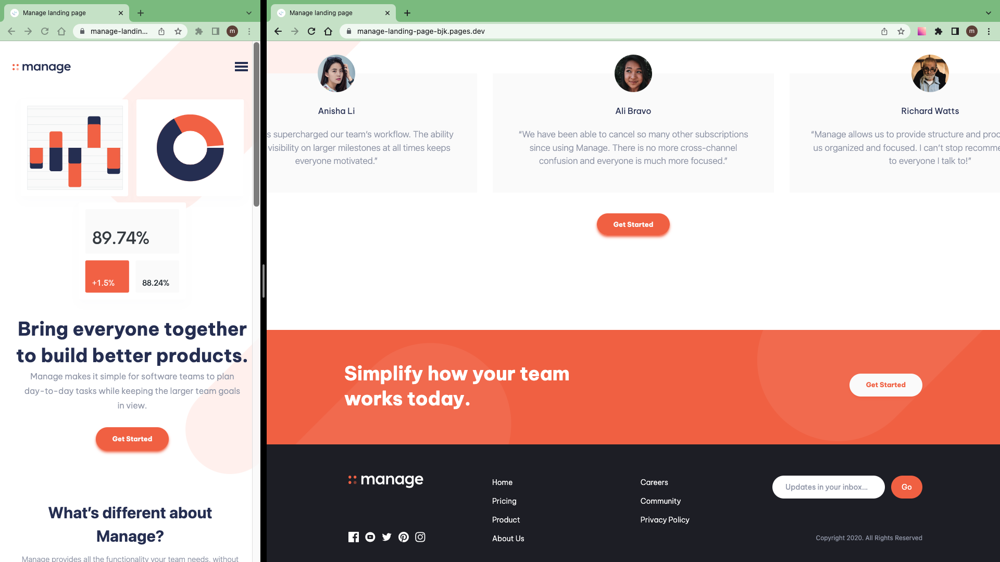

# Frontend Mentor - Manage landing page solution

This is a solution to the [Manage landing page challenge on Frontend Mentor](https://www.frontendmentor.io/challenges/manage-landing-page-SLXqC6P5).

## Table of contents

- [Overview](#overview)
  - [The challenge](#the-challenge)
  - [Screenshot](#screenshot)
  - [Links](#links)
- [My process](#my-process)
  - [Work time](#work-time)
  - [Built with](#built-with)
  - [What I learned](#what-i-learned)
  - [Continued development](#continued-development)
  - [Useful resources](#useful-resources)
- [Author](#author)
- [Acknowledgments](#acknowledgments)

## Overview

### The challenge

Users should be able to:

- View the optimal layout for the site depending on their device's screen size
- See hover states for all interactive elements on the page
- See all testimonials in a horizontal slider
- Receive an error message when the newsletter sign up `form` is submitted if:
  - The `input` field is empty
  - The email address is not formatted correctly

### Screenshot

### Links

- Solution: [frontendmentor.io](https://www.frontendmentor.io/solutions/age-calculator-app-UfFNvVZ2lX)

- Live Site: [cloudflare](https://age-calculator-app-bmm.pages.dev)

## My process

- Prepare Project (Download assets, Install Vite, Install TailwindCss, Initialize git, ...)
- Create manage landign page
  - 1.Identify a component
  - 2.Create component(Html, css, functionalilty)
  - 3.Go to step 1
- Prepare and Publish(Write README.md, Push to github, Make it live on Cloudflare, Publish to frontendmentor, ...)

### Work Time

- [My Clockify Report](https://app.clockify.me/shared/?)

### Built with

- [React](https://react.dev/)
- [TailwindCss](https://tailwindcss.com/)

### What I learned

### Continued development

### Useful resources

- [Nivo chart](https://nivo.rocks/)

## Author

- Frontend Mentor - [@siavhnz](https://www.frontendmentor.io/profile/siavhnz)

- github - [@siavhnz](https://www.github.com/siavhnz)

## Acknowledgments

Thanks To

[Frontendmentor.io](https://www.frontendmentor.io/challenges) - for their Excitement challenges  

[Perfect Pixel](https://chrome.google.com/webstore/detail/perfectpixel-by-welldonec/dkaagdgjmgdmbnecmcefdhjekcoceebi?hl=en) - for such a great extension
